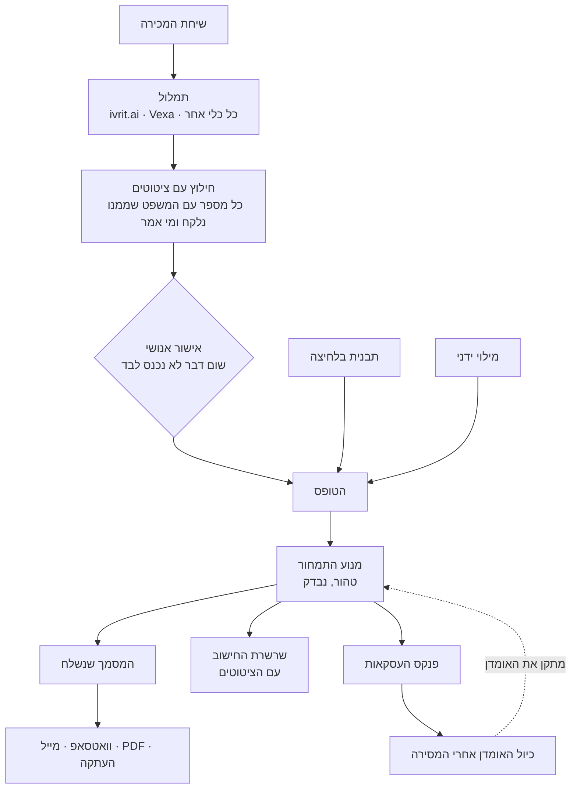

# PRE-CALL / POST-CALL

> **קוד קנייני, לא קוד פתוח.** הריפו גלוי לקריאה כדי שאפשר יהיה להתרשם ממנו,
> וזה לא רישיון. מותר לקרוא, להריץ מקומית להתרשמות, ולצטט קטעים עם ייחוס.
> אסור להשתמש כדי לתת שירות, להעתיק, לשנות, לפרוס, או לקחת את מודל התמחור,
> מודל האומדן, קטלוג הסקופ או הנימוקים שבהערות אל תוך מוצר אחר.
> הנוסח המחייב ב-[LICENSE](LICENSE). רישוי: erez2812345@gmail.com

שני כלים לשיחת אפיון עם לקוח, ומסך פתיחה שמנתב ביניהם. **POST-CALL** (`post-call.html`) הוא הכלי הראשי: הוא לוקח את מה שנאמר בשיחה והופך אותו להצעת מחיר מתומחרת. **PRE-CALL** (`pre-call.html`) הוא הכלי המוקדם יותר, שמכין את השאלות לפני השיחה.

הכניסה למוצר היא `index.html`, והיא לא מבקשת לבחור כלי. היא שואלת שאלה אחת — "איפה אתם עכשיו?" — ומנתבת לפי התשובה: לפני השיחה, מיד אחריה, אחרי ששלחתם, או רק מסתכלים. אף אחת מארבע התשובות לא מחייבת להכיר מושג מתוך המוצר, וזה הרעיון: מי שיצא עכשיו משיחה לא אמור לדעת מה ההבדל בין שני הכלים כדי להתחיל.

| | POST-CALL | PRE-CALL |
|---|---|---|
| למי | פרילנסרים לאוטומציה וייעול תהליכים | כל עצמאי שמוכר שירות מותאם |
| מאיפה בא המחיר | מהתהליך של הלקוח, ארבע שיטות | מהעסקה האחרונה **שלך**, שיטה אחת |
| דורש היסטוריה | לא. עובד בשיחה הראשונה בחיים | כן. בלי עסקה קודמת העוגן ריק |
| התוצר | מסמך הצעה עם מחיר, גבולות ולוח זמנים | תסריט שאלות |
| מודל | חינם עד ההצעה, בתשלום על הייצוא | חינם |

POST-CALL נבנה כתשובה לכשל מבני ב-PRE-CALL: עוגן המחיר שלו נשען על העסקה האחרונה של המשתמש, ולכן הוא ריק בדיוק אצל מי שהכלי מיועד לו — מי שעוד לא סגר עסקה.

## התמונה המלאה



**שלוש דרכים להתחיל, כולן מגיעות לאותו מקום:** להדביק תמלול, ללחוץ על תבנית, או למלא ידנית. המדריך מוביל בכל אחת מהן.

---

# POST-CALL

`post-call.html`. שאלות שמוציאות מהלקוח את המספרים, חישוב חי של מה התהליך עולה לו בשנה, ומסמך הצעה מתומחר.

## איך משתמשים

### המדריך · המוצר מוביל, המשתמש עונה

הגרסאות הקודמות הניחו מפעיל שיודע לנווט סביבת עבודה: יודע מה זה סקופ, יודע לבחור בין ארבע שיטות תמחור, ויודע מה לעשות כשמסמך מופיע. **פקדים גלויים במנוחה, בלי סדר עדיפויות, זה "הנה הכול, תסתדר"** — כלי למי שכבר יודע לכתוב הצעת מחיר, וזה לא מי שהמוצר מיועד לו.

`pc-guide.js` הופך את היחס. בכל רגע הוא עונה על שאלה אחת — מה האדם הזה צריך לעשות עכשיו ולמה, במשפט אחד בעברית פשוטה — והממשק נבנה סביב התשובה במקום סביב טופס.

**שלושה כללים שהוא אוכף, ושיש להם בדיקות:**

| כלל | מה נבדק |
|---|---|
| בדיוק פעולה אחת. אף פעם לא שתיים, אף פעם לא אפס | הליכה על כל מצב אפשרי, כולל טופס ריק וטופס מלא. מסך בלי מה לעשות הוא המקום שבו משתמש ראשון סוגר את הטאב — לכן גם "מוכן" הוא פעולה |
| אפס מילים שצריך לדעת מראש | רשימת ז'רגון (סקופ, ROI, טריאנגולציה, אינטגרציה, payback…) נבדקת מול כל כותרת, כל הסבר, כל אזהרה וכל נימוק |
| אף פעם לא להאשים על "לא ידעת איפה זה" | הכפתור פותח את המגירה, גולל, ומציב את הסמן — ובשלב שדורש שני מספרים, על הראשון שעוד ריק |

**הכלי בוחר את שיטת התמחור, לא המשתמש.** ארבעה צ'יפים ששואלים "ערך, מחירון, עלות+מרווח או עסקה דומה?" זו שאלה שרק מי שכבר מתמחר עבודה יודע לענות עליה, ותשובה שגויה עולה לו כסף. עכשיו הכלי מכריע ואומר למה במשפט אחד — הצ'יפים נשארו מאחורי מגירת "לשנות בעצמי".

**מספרים שלא יכולים להיות נכונים נאמרים כתצפית עם החשבון:** "לפי מה שהזנת התהליך לוקח כ-27,375 שעות בשנה — יותר מעובד אחד במשרה מלאה". גבול אדום לא מלמד כלום את מי שלא יודע למה.

נמדד בהליכה עיוורת בטלפון, בלי לקרוא קדימה ובלי לחקור — רק ללחוץ על מה שהמסך אומר: **9 הוראות מדף ריק להצעה מתומחרת מלאה.**

### מהשיחה עצמה · התמלול הוא ההוכחה, לא הקיצור

המסגרת המתבקשת היא "תמלול נכנס, טופס מתמלא, זמן נחסך". זו הארכיטקטורה הלא נכונה למוצר הזה, ולטעות בה היה עולה בדבר היחיד שיש לו.

כל טענה של POST-CALL נשענת על כך שהמחיר נגזר ממספר **שהלקוח אמר**. בגלל זה פסקת ה-ROI יוצאת מהמסמך כשהמספר הוא הערכה שלכם, בגלל זה שורת "כמה עולה לו כל שבוע" נעלמת באותו כלל, ובגלל זה יש אזהרה כשמספר מנוחש אחד נושא את רוב הערך. **וכל זה נשען היום על סימון של המפעיל** — דיווח עצמי על טיב העבודה של עצמך, שהוא הסוג הכי פחות אמין.

**ולכן ברירת המחדל של השדה הזה אינה תשובה.** היא הייתה `prompted` — כלומר שאלה שאף אחד לא נגע בה נשמרה, נספרה ונצטטה כאילו נענתה. עכשיו היא "עוד לא סימנתי", ואותו כלל מכריע את השאר: מספר שהכלי לא יכול לייחס ללקוח הוא מספר שהוא לא מצטט ללקוח. פסקת ההחזר ושורת השבוע יוצאות, אזהרה אומרת למה, והמדריך מצביע על השדה. **מה שלא קורה זה שינוי מחיר** — אי-סימון לא נוגע בו, כי שאלה שלא נענתה היא לא קביעה על מאיפה המספר בא. סימון `mine` **כן** משנה מחיר, כי הוא קביעה כזאת, והוא מעביר את שיטת התמחור.

תמלול משנה קטגוריה. הוא לא רק חוסך הקלדה — **הוא הופך את מקור המספר מטענה לראיה.**

| כלל | למה |
|---|---|
| **שום דבר לא נכנס לבד** | חילוץ מציע, אדם מכריע. כל מועמד מוצג עם המשפט שממנו נלקח ועם מי אמר אותו |
| **ערך בלי ציטוט אינו ערך** | הוא ניחוש שלובש מספר — בדיוק מה שכל שאר הכלי קיים כדי למנוע. שורה בלי ציטוט נמחקת, לא מוצגת מעומעמת |
| **ציטוט שלא נמצא בתמלול מסומן** | מודל שפרפרזה המציא את הראיה. השורה נשארת, מסומנת «קרא בעצמך» |
| **מקור המספר נגזר, לא נשאל** | הלקוח נקב מעצמו → `unprompted`. אחרי שאלה שכיוונה לשם → `prompted`. אין ציטוט של הלקוח → `mine`. בלי תמלול השדה מתחיל ב"עוד לא סימנתי", והכלי לא מניח דבר |

**איפה מודל השפה? לא כאן.** הכלי כותב פרומפט, המפעיל מריץ אותו איפה שכבר יש לו אחד, ומדביק בחזרה — בדיוק הדפוס ש-PRE-CALL כבר משתמש בו לפרופיל העסק. בלי שרת, בלי מפתח, בלי עלות, וההבטחה ששום דבר לא עובר דרכנו שורדת, כי המפעיל מחליט לאן התמלול הולך.

**נפילה לאחור מקומית:** בלי מודל בכלל, הכלי מושך מספרים שיושבים ליד מילת יחידה ושומר את המשפט סביבם. חלש יותר, ומסומן ככזה.

**נמדד מקצה לקצה:** שיחת דוגמה של 1,486 תווים → 13 שורות עם ציטוטים → מסמך מתומחר, **2.5 שניות**, ומקור המספרים נגזר נכון ל-`prompted` כי הלקוח נקב בנפח רק אחרי ששאלו אותו.

### שיחת דוגמה

דוגמה שהיא טופס מלא מלמדת את הטופס. דוגמה שהיא **תמלול** מלמדת את המוצר — כי כל הטענה היא שהמחיר יוצא ממה שנאמר בחדר, ואי אפשר להדגים את זה עם טופס.

התמלול המצורף כתוב כך שיכיל בדיוק את המקרים שהכלי דעתן לגביהם: מספר שנמסר רק אחרי שנשאלו עליו, מספר אחר שהלקוח נקב בו מעצמו, ניסיון קודם שנכשל, יותר ממחליט אחד, ושלב בוואטסאפ. הוא בדיוני ומסומן ככזה.

### תמלול · מה מחברים לזה

| שכבה | פרויקט פתוח |
|---|---|
| זיהוי דיבור בעברית | [ivrit.ai](https://github.com/ivrit-ai/ivrit.ai) — Whisper מכוונן לעברית, `large-v3` / `turbo`, מודלים ב-HuggingFace |
| בוט שמצטרף לשיחה | [Vexa](https://github.com/Vexa-ai/vexa) — Apache-2.0, self-hosted, Google Meet / Teams / Zoom |

**אין ריפו פתוח שמחבר תמלול להצעת מחיר.** זה הפער שהכלי הזה ממלא, והוא הסיבה שהחיבור הוא הדבקה ולא אינטגרציה: הדבקה עובדת היום, מול כל כלי תמלול שקיים, בלי לבנות מתאם לכל אחד מהם.

### תבניות · הקיצור מדף ריק להצעה

הזמן לא נשרף בהקלדה. הוא נשרף בניסוח הסקופ ובהחלטה מה להשאיר בחוץ — ולכן תבנית שרק ממלאת מספרים עונה על השאלה הלא נכונה.

חמש תבניות לתהליכים הנפוצים: הזמנות מוואטסאפ לחשבונית, לידים מהאתר ל-CRM, גבייה ותזכורות, דוח שבועי מכמה מקורות, ותיאום פגישות. כל אחת מגדירה מערכות, מספרים טיפוסיים, טקסט פתיחה — **ואת החלטות הסקופ של הוורטיקל**: אילו שורות זזות מברירת המחדל ולמה דווקא הן נושכות בעבודה כזאת.

לדוגמה, בהזמנות מוואטסאפ *מקרי קצה* עוברים מ"לא כלול" ל"בתוספת": הזמנה שמגיעה כטקסט חופשי נכתבת בכל פעם אחרת, ולכן החריגים אינם תקלה להחריג אלא עבודה שאפשר למכור. בלידים *ניטור* עובר ל"כלול": ליד שנופל בשקט לא מייצר תלונה, הוא פשוט לא מגיע, והלקוח מסיק שהפרויקט נכשל.

לחיצה אחת → הצעה מתומחרת מלאה. נמדד: **כחצי שנייה מדף ריק למסמך של 1,900 תווים עם מחיר**.

התבנית כותבת רק נקודת פתיחה. המספרים טיפוסיים ולא נמדדו אצל הלקוח שלך, וההערה על המסך אומרת את זה במפורש — הם קיימים כדי שיהיה מה לתקן, לא כדי להישלח כמו שהם.

## מה קורה עם המספרים

### זרימת המידע · מאיפה יצא המחיר הזה

הציטוטים היו מתאדים. שלב התמלול ידע לכל מספר מאיזה משפט הוא בא ומי אמר אותו — ואז המפעיל אישר, הטופס התמלא, וכל הראיות נעלמו. מה שנשאר על המסך היה מחיר עירום, וזו בדיוק צורת הדבר שהכלי הזה קיים כדי להתווכח איתו.

עכשיו השרשרת נשמרת ומוצגת. לא דיאגרמה של איך התוכנה בנויה — למפעיל לא אכפת — אלא החשבון שהופך ארבע תשובות למספר שהוא עומד לשלוח, כל שלב בשפה של החדר:

```
1  40 ליום × 365            =  14,600 פעמים בשנה
2  14,600 × 8 דקות ÷ 60     =  1,947 שעות בשנה     «שמונה דקות בערך» — הלקוח
3  1,947 × ₪85 × 80%        =  ₪132,373 בשנה
4  3 תקלות × ₪1,800 × 12    =  ₪64,800 בשנה        «בסביבות אלף שמונה מאות» — הלקוח
5  ₪132,373 + ₪64,800       =  ₪197,173 בשנה
6  3 תוכנות                 →  24 שעות עבודה, רצפה ₪6,600
7  25% מ-₪197,173           =  ₪49,290
```

שני כללים ששווים יותר מהתמונה:

**הנוסחאות נקראות מהפלט של המודל, אף פעם לא מחושבות מחדש.** תצוגת זרימה שעושה חשבון משלה תציג בסוף שרשרת שלא מסתיימת במחיר שלידה — ואז היא גרועה מכלום, כי היא הסבר שבטוח בעצמו וטועה. יש בדיקה שמוודאת שהשלב האחרון שווה בדיוק ל-`m.price`.

**שלב בלי קלט נעדר, לא מוצג כאפס.** אפס הוא מדידה; ריק הוא האמת.

**והשרשרת מסמנת את החוליה החלשה:** כשצעד אחד נושא מעל 55% מהערך, כתוב שם «X% מהערך נשען על הצעד הזה. אם מספר אחד כאן לא מדויק, המחיר זז איתו».

**שלושת הבדיקות האלה קיימות גם כשורת תגים ליד המחיר עצמו**, לא רק בפנים השרשרת המקופלת: בטווח שניתן להגנה, מחזיר את עצמו בזמן סביר, לא תלוי במספר בודד. שום נתון חדש לא נוסף בשביל זה — שלושתם כבר היו מחושבים, אחד מהם כבר מוצג כפסקה בתיבת ה"מסקנה". מה שהיה חסר הוא מבט אחד לפני שפותחים את הפה, לא פסקה לקרוא. הרעיון הזה בא ממחקר מתחרים ישיר: `freelancecalculator.app`, המתחרה הכי קרוב באופיו (בלי הרשמה, מיידי, מציג את הפירוק ולא רק מספר סופי), מציג "בדיקות שמירה" (guardrail checks) בפורמט עובר/נכשל ליד המחיר — בעוד רוב הכלים האחרים שנבדקו (Nusii, Better Proposals, Instaprice) דורשים הרשמה כבר בצעד הראשון, ו-Qwilr מבסס את הבידול שלו על מעקב אחרי מסמך שמתארח אצלם, שני דברים שהכלי הזה נמנע מהם בכוונה. שורת התגים ריקה כשעדיין אין ערך שנתי מהלקוח — שלושה וי ירוקים מעל מחיר שנשען רק על ניחוש גרוע יותר מכלום.

### הלקוח הספציפי · מה המסמך משנה לבד

התבניות מביאות אותך לוורטיקל. זה מביא אותך לעסק הבודד: מאפייה ויבואן עם שישים עובדים שמריצים בדיוק את אותו תהליך וואטסאפ-לחשבונית לא צריכים את אותו מסמך, וההבדל אינו המחיר.

**הכלל: להסיק, לא לשאול.** המוצר קיים כי כתיבת הצעה עולה זמן, אז לקנות התאמה בעזרת שאלון נוסף היה מוציא בדיוק את מה שבאנו לחסוך. הכול נקרא מתשובות שכבר נתת — מערכות, נפח, מי מחליט, אם ניסו כבר, ומאיפה הגיע המספר.

| מה נקרא | מה זה משנה במסמך |
|---|---|
| יותר מאדם אחד מחליט | תוקף 21 יום במקום 14. הצעה שפוקעת לפני שהם נפגשים מייצרת תמחור מחדש, בדרך כלל נמוך יותר |
| ERP / סליקה / 5+ מערכות | שוטף+30 והזמנת רכש לפני התחלה, וסעיף גישות עם אחראי בשם והשלכה על לוח הזמנים |
| **המספר בשאלה 6 הוא שלך** | **פסקת ה-ROI יורדת מהמסמך שנשלח.** לצטט ללקוח מספר שאתה המצאת זו שאלה אחת ("מאיפה זה?") שאין עליה תשובה. המחיר נשאר, ההצדקה עוברת להיקף |
| כבר נשרפו פעם | סעיף מסירה: תיעוד, חשבונות על שמם, הרשאה לערוך בעצמם. מי שנשרף לא קונה אוטומציה, הוא קונה את זה שהיא תמשיך לרוץ בלעדיך |

שני דברים שומרים על זה כנה:

**זה מוצג, לא מופעל בשקט.** פאנל מעל המסמך אומר מה הוסק, מהיכן, ומה זה שינה — עם רמת ביטחון. מסמך ששכתב לבד את תנאי התשלום שלו גרוע ממסמך שלא התאים את עצמו בכלל, כי אתה שולח את שניהם, ורק אחד מהם אפשר לבדוק.

**אפשר לדרוס.** קריאה אוטומטית שאי אפשר לתקן היא הגרועה מכולן. בורר אחד קובע ידנית את סוג הלקוח, והפאנל אומר במפורש שהקריאה נדרסה במקום להמשיך להציג ראיות שכבר לא בתוקף.

שאלות שמשנות דווקא את המסמך של הלקוח הזה מסומנות במקום שבו הן כבר יושבות. הן לא זזות בין מגירות — אובדן ההתמצאות עולה יותר ממה שההדגשה מרוויחה.

### ויזואליזציה · מה שיש לו ראיות, ומה שנשלל

התבקשתי צבעים, אינפוגרפיקה והמחשות. הספרות מתפצלת לשתי ערימות, ורק אחת מהן נכנסה.

**נבנה:**

| מה | הראיה |
|---|---|
| **מערך אייקונים** — 52 ריבועים, אחד לשבוע, צבועים עד שההשקעה חזרה | עזרים ויזואליים נמצאים עקבית קלים יותר להבנה, מהירים לעיבוד וזכירים יותר מאותו נתון בטקסט, **והתועלת גדולה במיוחד לבעלי אוריינות מספרית נמוכה** — בדיוק הקהל כאן. "17.8 שבועות" דורש חשבון; 18 ריבועים מתוך 52 פשוט נראים |
| **סרגל חלק-מתוך-שלם** — המחיר מול מה שהתהליך עולה בשנה | זו ההשוואה היחידה שהמפעיל צריך לעשות בחדר, וסרגל הופך את היחס לקריא בלי חילוק |
| **אף מצב לא בצבע בלבד** | WCAG 1.4.1. כ-1 מ-12 גברים עם ליקוי בראיית צבע, ובוהק, מסך גרוע והגדלה מנטרלים הפרשי גוון לכל השאר. כל הערכה נושאת **מילה** ("מהיר/סביר/איטי") וגם מסגרת שונה, לא רק גוון |

**נשלל, למרות שביקשת:**

**איורים דקורטיביים.** אפקט ה-seductive details הוא מהממצאים המשוחזרים ביותר בלמידה מרובת-מדיה: תמונות מעניינות אך לא רלוונטיות למשימה מורידות באופן עקבי שליפה והבנה. מעקב עיניים מראה שהנזק עוקב אחרי הקשב שהן גונבות — **והכי חמור אצל בעלי קיבולת זיכרון עבודה נמוכה, שהם בדיוק מי שהכלי מיועד לו.** ציור של רובוט ליד המחיר היה הופך את הדף ליפה יותר ואת המחיר למובן פחות. אין כאן אף אחד.

**צבע דקורטיבי.** גוון משמש רק היכן שהוא נושא משמעות שקיימת גם במילים.

**"כמה עולה לו כל שבוע שהוא לא מחליט"** מוצג — אבל **נעלם לגמרי כשהמספרים הם הערכה שלך ולא של הלקוח.** אי אפשר ללחוץ על מישהו עם חשבון על מספר שהמצאת בשבילו. אותו כלל שמסיר את פסקת ה-ROI מהמסמך.

## התמחור

### למה ורטיקל אחד

הערך של אוטומציה ניתן לכימות בנוסחה מוסכמת ומפורסמת:

```
(שעות בשנה × עלות שעה מלאה × אחוז שנחסך) + (תקלות × עלות)  =  ערך שנתי
```

עלות שעה מלאה היא ברוטו × 1.25 עד 1.4, כולל עלויות מעסיק. זה מה שמאפשר לתמחר בלי היסטוריית עסקאות: המספר מגיע מהלקוח, לא מהוותק של המוכר.

### ארבע שיטות התמחור

אין שיטה אחת נכונה. השוק עובד בשלוש משפחות — עלות, שוק, ערך — ומנוסים מצליבים ביניהן. הכלי מחשב את כל מה שיש לו נתונים עבורו, ואתם בוחרים במה **להגן עליו בשיחה**.

| שיטה | מה היא צריכה | איך היא מחושבת | מתי היא חזקה | מתי היא חלשה |
|---|---|---|---|---|
| **עלות + מרווח** | כלום | אומדן שעות × התעריף שלך + מרווח (30% כברירת מחדל) | תמיד זמינה, שקופה ללקוח | תקועה על הוותק שלך, לא על מה שהעבודה שווה. השיטה שמניבה הכי פחות באופן מבני |
| **מחירון שוק** | כלום | אמצע הטווח המקובל לרמת המורכבות (נגזר ממספר המערכות ומסוג האינטגרציה) | אין היסטוריה ואין מספרים מהלקוח | ממצעת אתכם לאמצע השוק בהגדרה. חלשה כשהעבודה חריגה |
| **ערך / ROI** | מספרים מהלקוח (שאלות 2, 3, 4, 6) | 25% מהערך השנתי, בתוך טווח הגנה של 17%–33% | הכי מניבה כשהתהליך יקר ביחס לבנייה | קורסת אם הלקוח מנחש את המספרים, או אם מצטטים מחיר לפני שאבחנתם |
| **עסקה דומה** | היסטוריה שלכם | מה שגביתם על עבודה דומה × מקדם היקף | מדויקת כשבאמת עשיתם משהו דומה | מנציחה תמחור-חסר קודם. אם העסקה האחרונה הייתה זולה, היא ננעלת קדימה |

### איזו שיטה מניבה הכי הרבה

זו תכונה של **העסקה הספציפית**, לא כלל גורף — והכלי אומר לכם איזו מנצחת כאן:

| התהליך | עלות+מרווח | מחירון | ערך/ROI | מה הכלי אומר |
|---|---|---|---|---|
| צנוע, ₪22.6k לשנה | ₪7,800 | ₪7,500 | ₪6,600 | *עלות+מרווח מניבה ₪1,200 יותר. הערך קטן מדי מכדי שתמחור לפי ערך ינצח* |
| יקר, זמן הבעלים, ₪110k לשנה | ₪7,800 | ₪7,500 | **₪27,570** | *זו גם השיטה שמניבה הכי הרבה כאן* — פי 3.5 |

תמחור לפי ערך אכן מניב יותר, אבל **לא תמיד ולא מסיבה מיסטית**. המנגנון הוא עוגן: המחיר נשפט מול מה שהתהליך עולה ללקוח, במקום מול התעריף השעתי שלכם. כשהתהליך זול, אין עוגן גבוה, והשיטה מפסידה לתמחור עלות. הכלי לא יחזור על "ערך תמיד מנצח" בזמן שהמסך מראה אחרת.

### מעקות בטיחות

- **רצפת עלות על כל השיטות.** שיטה שמתמחרת מתחת לעלות המסירה אינה אסטרטגיה. הכלי מציג במפורש כשהוא העלה מחיר לרצפה, ומה השיטה נתנה לפני כן.
- **תקרת הגנה, 35% מהערך השנתי.** מעליה הלקוח מחזיר פחות מפי 1.9 בשנה הראשונה. הכלי מסמן ומסביר שכדאי לצמצם סקופ במקום למכור.
- **התראה על הקלט הרעוע.** אם הערכת התקלות (שאלה 6) שולטת ביותר מ-55% מהערך השנתי, הכלי אומר את זה. זה המספר שהלקוח שולף בעל פה, והמחיר תלוי בו יותר מבכל השאר.
- **פער בין עלות לערך הוא לא תקלה.** הוא כל הפואנטה של תמחור לפי ערך, ולכן אין עליו אזהרה.

### דיוק במקום עיגול

המחירים מעוגלים לעשרות, לא למאות. מחקר משא ומתן מוצא שהצעה ראשונה מדויקת מושכת הצעות-נגד פחות אגרסיביות ונקראת כמבוססת יותר. ₪27,570 עדיף על ₪27,500 כעוגן. **הערכת הערך** לעומת זאת נשענת על ניחושים ומוצגת ככזו — הענווה שייכת לאומדן, לא להצעה.

כל ההנחות ניתנות לשינוי בכלי. הן ברירות מחדל לכיול, לא נבואה.

## אחרי שהמסמך מוכן

### שליחה

הכלי נעצר בלוח, וזה השאיר את השלב הכי נוטש בכל המסע — השליחה — למשתמש. עכשיו יש שלושה מסלולים: וואטסאפ, מייל, והעתקה, וההצעה מסומנת אוטומטית כ"נשלחה" כדי שהפנקס יידע על מה עוד לא ענו.

**כל מסלול נבדק לפני שהוא מוצע.** קישור שנחתך באמצע גרוע מקישור שאין: הלקוח מקבל חצי הצעה והמפעיל לא יודע. מגבלת mailto נמדדת על המחרוזת **המקודדת** — עברית מתנפחת פי שלושה — ולכן הצעה שנראית קצרה עדיין יכולה לחרוג. מסלול שלא יכול לשאת את המסמך הזה אומר למה ומה לעשות במקום. **העתקה לעולם לא נחסמת.**

טלפון שלא ניתן לפענוח לא הופך למספר מנוחש — וואטסאפ נפתח עם בורר צ׳אט. הודעה למספר שגוי היא לא טעות הפיכה.

### עסקה שמורה נפתחת מחדש

שמירה הייתה דלת חד-כיוונית: הלקוח חוזר עם שינוי אחד, והכול נכתב מחדש. עכשיו כל עסקה שומרת איתה את מצב הטופס המלא ואפשר לפתוח אותה. הטעינה מוכרזת — דף שממלא את עצמו בשקט נראה בדיוק כמו דף שמציג את הלקוח הלא נכון.

### שלב 4 · מה קרה בפועל

פנקס עסקאות מקומי. כל הצעה נשמרת עם **האומדן נעול ברגע השמירה**, ואחרי המסירה מדווחים שעות בפועל. אחרי חמש מסירות הכלי מציג את יחס האומדן-מול-ביצוע — וזה מה שהופך את טבלת האומדן ממותאמת-אחורה למדודה. עד אז היא מסומנת `לא מכויל`, והסימון יורד בזכות ראיות ולא בזכות עריכת התווית.

הפנקס מציג גם שיעור סגירה (רק על עסקאות שהוכרעו — שתיקה אינה דחייה) ואת הפער בין המחיר שנשלח למחיר שנסגר.

**כל זה נשאר ב-localStorage של הדפדפן.** שמות לקוחות, מחירים ומסמכים לא עוזבים אותו.

### הכלי על עצמו · מה הייעוץ הזה היה שווה לך

הכלי אומר על עצמו דברים ישרים — טבלת האומדן הותאמה אחורה, מחירון השוק מומר
מטווחים אמריקאיים, מקדם הערך הוא אמצע של רצועה. הכול נכון, והכול עדיין הצהרה
על ברירות המחדל שלו ולא ראיה עלייך.

`pc-history.js` הופך חלק מזה לראיה, מהנתונים שכבר יושבים בפנקס:

- **דיוק האומדן כהתפלגות, לא כממוצע.** חמש עבודות שכל אחת חרגה ב-20%, וארבע
  מדויקות עם אחת שהתפוצצה — נותנות כמעט אותו יחס ודורשות תיקונים הפוכים.
  יחס יחיד לא יכול להבחין ביניהן, ולכן הוא לא אומר כלום. כאן מדווחים כמה היו
  בתוך ±25%, וכשיש חריג — הוא מוזכר בשמו.
- **המחיר ששלחת מול המחיר שנסגר.** ההנחה הממוצעת מחושבת רק על העסקאות שבהן
  באמת ניתנה הנחה. מיצוע האפסים פנימה הופך ויתור של 17% ל"3.3% בממוצע".
- **איזו שיטת תמחור מחזיקה אצלך.** נקרא לפי השיטה שקבעה את המחיר בפועל, לא
  לפי זו שנבחרה — ביקוש ל"עסקה דומה" בלי עסקה קודמת מקבל מחיר מעלות, ועסקה
  שירדה לרצפת העלות נרשמת כ"רצפת עלות" ולא כשיטה שנלחצה.
- **מאיפה הגיע המספר שעליו נבנה המחיר.** הטופס שואל את זה מאז ששלב התמלול
  קיים, וכל עסקה שמורה נשאה את התשובה יחד עם שאר הטופס — ואף אחד לא קרא אותה.
  עכשיו זה שדה של עצמו על הרשומה, ופילוח שני לצד פילוח השיטות: כמה הצעות, כמה
  נסגרו, וכמה החזיקו את המחיר המלא, לפי ארבע התשובות — הוא נקב מעצמו, הוא נקב
  אחרי שאלה, אתה הערכת, או שלא היה מספר. ארבע, לא שלוש: "לא היה מספר" היא
  תשובה, והיא לא אותו דבר כמו הצעה שנשמרה לפני שמישהו נשאל.

  ברירת המחדל של הטופס אינה אחת מהארבע, ולכן **כל שורה בפילוח היא בחירה שמישהו
  עשה.** קודם היא הייתה `prompted`, והקבוצה הזאת ערבבה מי שסימן עם מי שלא נגע —
  היה שם סייג שהודה בזה, והוא נמחק יחד עם העמימות. סייג שלא מתאר את הקוד גרוע
  מאין סייג: הוא מלמד את הקורא להנחות גם את אלה שכן מתארים.

  אותו סף שכבר נקבע לשיטות — שלוש הצעות באותה קבוצה לפני שנאמר עליה משהו — ואותו
  כלל הנחה: ממוצע רק על ההצעות שבהן באמת ירד מחיר. רשומה שאין בה תשובה **לא
  מקבלת ערך מנוחש** ולא נעלמת בשקט; היא נספרת בנפרד ונאמרת ברשימת מה שאי אפשר
  לומר. רשומות ישנות נקראות מתוך הטופס השמור, כך שפנקס מלא לא מדווח על עצמו
  כדף חלק — ושום דבר לא משכתב את מה שכבר שמור אצלך כדי שפאנל ייראה מיושב.

**וגם מה שעדיין אי אפשר לומר**, עם ספירה לאחור לכל דבר, ולצידו הסתייגות שלא
פגה: אלה העסקאות שלך, לא מדד שוק. הפאנל אומר אם האומדן שלך מדויק, לא אם
המחיר שלך נכון.

### התשלום

השאלות, החישוב וטווח המחיר חינם. המסמך שנשלח ללקוח בתשלום.

המפתח נבדק **בשרת כשיש שרת לשאול**, ומול ספרת ביקורת בדף כשאין:

| מצב | מי מכריע |
|---|---|
| נפרס עם `POSTCALL_KEYS` | `/api/license`. מפתח מומצא בפורמט הנכון **נדחה** |
| נפרס בלי המשתנה | ספרת הביקורת. השער רך עד שיש מה למכור |
| `file://` או בלי רשת | ספרת הביקורת. מי ששילם לא ננעל בחוץ בגלל הרשת |

הנפילה-לאחור ניתנת לעקיפה למי שפותח כלי מפתחים, וזו עדיין החלטה מודעת לשלב הראשון. מה שהשתנה: היא כבר לא הבדיקה היחידה. מפתח שמור נבדק מחדש פעם ביום, כך שכתיבה חד-פעמית ל-localStorage לא קונה גישה לנצח.

**הכלל חל לשני הכיוונים, וזה מה שתוקן בביקורת.** `POSTCALL_KEYS` היא רשימת היתר, ולכן לשרת אין שום סיבה לדרוש ספרת ביקורת — והוא לא דורש. מפתח שהונפק ביד יכול להיות תקף בשרת ולהיכשל בספרה. בגרסה הקודמת מפתח כזה נפתח פעם אחת, ואז נזרק בטעינה הבאה — כלומר לקוח משלם שחוזר בבוקר וחוטף שוב את קיר התשלום. עכשיו:

| מה שמור בדפדפן | מה קורה בטעינה |
|---|---|
| אישור קודם מהשרת | נפתח מיד, בלי בקשה. גם בלי רשת |
| ספרת ביקורת תקינה | נפתח מיד, אופטימית, כמו קודם |
| רק הפורמט תקין | לא נפתח מעצמו — נשאל השרת, ונפתח אם ענה "כן" |
| השרת ענה "לא" | ננעל, והמפתח נמחק |

מחרוזת בפורמט הנכון שנכתבה ידנית ל-localStorage עדיין לא פותחת כלום.

### הנפקת מפתח · למה לא כותבים אותו ביד

מפתח צריך לספק **שתי רשויות בלתי תלויות**, ורק אחת מהן הייתה נגישה ביד. `POSTCALL_KEYS` היא רשימת היתר ולא בודקת את התו האחרון; ספרת הביקורת בדף כן. לכן מפתח שמקלידים ישר לתוך המשתנה תקף בשרת ונכשל בספרה.

בפריסה זה מכוסה — האישור מהשרת נחתם ועוקף את הספרה. מה שלא מכוסה הוא **כשאין שרת לשאול**: מ-`file://`, בלי רשת, או אחרי ניקוי הדפדפן. שם `fetch` נכשל, הספרה מכריעה, והיא אומרת לא. כלומר לקוח משלם שננעל בחוץ — במצב שה-README הזה מבטיח שעובד במלואו.

נמדד בדפדפן אמיתי, בלי `/api/license`:

| מה הוקלד | מה קרה |
|---|---|
| `PC-ABCD-EFGH` — צורה תקינה, נכתב ביד | נדחה. הקיר נשאר פתוח, שגיאה הוצגה, שום דבר לא נשמר |
| מפתח מ-`tools/mint-key.js` | נפתח, הקיר נסגר, המפתח נשמר. בלי חתימת שרת — כי לשרת לא הייתה דעה |

לכן מנפיקים עם `node tools/mint-key.js`. הכלי מייצר מפתחות שעוברים את שתי הרשויות, מונע הנפקה כפולה מול `POSTCALL_KEYS` שכבר מוגדר, ומשתמש ב-`crypto.randomInt` ולא ב-`Math.random` — מחרוזת מ-`Math.random` ניתנת לשחזור מכמה דגימות, כלומר המפתח של קונה אחד מצמצם את החיפוש אחרי הבא.

שבעת התווים נדגמים מאלפבית מצומצם, בלי `0/O` ובלי `1/I`, ומפתח שספרת הביקורת שלו נופלת מחוץ לאלפבית הזה נזרק ונדגם אחד אחר. אלה מפתחות שמקלידים מתוך מייל ולפעמים מקריאים בטלפון.

```
node tools/mint-key.js                       מפתח אחד
node tools/mint-key.js 3 --env               שלושה, ושורה מוכנה ל-POSTCALL_KEYS
node tools/mint-key.js --for "שם הקונה"      ושורה לפנקס: מפתח, תאריך, שם
node tools/mint-key.js --check PC-AB23-CD4F  מה יקרה למפתח הזה, ואיפה
```

`--check` אומר את שלושת הדברים בנפרד: צורה, ספרת ביקורת, והאם הוא ב-`POSTCALL_KEYS` — כי מפתח יכול להיות תקין לחלוטין ופשוט לא להיות ברשימה, וזו הכשל השכיח.

`tools/` מוחרג מהפריסה ב-`.vercelignore`. אין בו סוד — הספרה נשלחת לדפדפן ב-`assets/pc-gate.js` בכל טעינה — אבל לדף שמנפיק מפתחות בצורת רישיון אין סיבה להיות נגיש מהאינטרנט. 35 ביט אנטרופיה בטוחים כאן **בגלל** התקרה של עשרה ניסיונות לעשר דקות מול רשימה של קומץ מפתחות, לא בזכות עצמם.

**רישום:** `--for` מדפיס שורה של מפתח, תאריך ושם. היא נועדה לפנקס פרטי, לא לרפו. בלי המיפוי הזה, ביטול גישה לקונה בודד בעוד חצי שנה הוא ניחוש.

### מה הקיר אומר לקונה

הקיר היה בשני מצבים, והשני היה `alert()` שאמר "החלף את `PAYMENT_URL` בקובץ `assets/pc-gate.js`". ההודעה הזאת מנוסחת למי שכתב את הקוד, והוצגה למי שניסה לשלם. זה הכשל של הקיר בדיוק ברגע היחיד שבו יש לו תפקיד.

שלושה מצבים, והקיר אומר באיזה הוא נמצא:

| מה מוגדר | מה הקונה רואה |
|---|---|
| `PAYMENT_URL` | דף תשלום נפתח בלשונית חדשה. שום הסבר נוסף |
| `SALES.contact` | מכירה ידנית. הכפתור **"בקשו מפתח בהודעה"** — לא "קנה", שמבטיח מפתח במקום — כמה זמן זה לוקח, מה לכתוב בהודעה, והכתובת גם כטקסט על המסך |
| אף אחד מהם | "הכלי עוד לא נמכר." המחיר והכפתור נעלמים, ושדה המפתח ממשיך לעבוד למי שכבר שילם |

שני דברים שנבדקים ולא נסמכים על תשומת לב:

**`mailto` מחליף את הכתובת, `https` פותח לשונית.** `window.open` על `mailto` משאיר לשונית ריקה יתומה. ולהיפך: ניווט מהדף בזמן שהצעה לא שמורה פתוחה על המסך מאבד את המסמך שהקונה משלם כדי לייצא.

**הכתובת מוצגת כטקסט, לא רק מאחורי הכפתור.** `mailto` בדפדפן בלי תוכנת דואר מוגדרת הוא לחיצה שלא עושה כלום — סוג הכשל שהפרויקט הזה כבר מצא יותר מפעם אחת.

`SALES.contact` **ריק ברפו בכוונה.** מה שנכנס לשם מתפרסם בדף שכל אחד קורא וכל crawler סורק, ולכן איזו כתובת לחשוף היא הכרעה של המפעיל ולא ברירת מחדל שמישהו יורש בטעות.

### מתי בדיוק נעצרים, ולמה יש בקשת מפתח מראש

השער חוסם **שלוש פעולות**: `copy`, `print`, `send`. כל השאר פתוח — שמירה לפנקס, סימון כנשלחה, הצעת המעקב, כלי התמלול, אישור הסקופ והגיבוי. הכלל הוא לא "מתי משתמשים" אלא **מתי המסמך יוצא מהדפדפן**. ההצעה עצמה גלויה במלואה לכולם, כי היא הממשק.

שלוש הפעולות האלה קורות באותו רגע: ההצעה גמורה ועומדת לצאת ללקוח. ובמכירה ידנית התשובה ל"אני צריך מפתח" היא "אשלח תוך כמה שעות" — כלומר **השער נופל בנקודה הגרועה ביותר בכל התהליך להכניס בה המתנה.**

לכן הדרישה מוצגת מוקדם יותר, שורה אחת מתחת לכפתורי הייצוא, עם "בקשו מפתח מראש" ו"אחר כך". כל הסיכון בתוספת כזאת הוא שהיא תהפוך לשלט מכירה קבוע ליד העבודה, ולכן רוב מה שנבדק הוא **מתי היא מוסתרת**:

| מצב | הערה מוצגת |
|---|---|
| טופס ריק, אין מחיר אמיתי | **לא.** בלי משהו ששווה לייצא זו פרסומת ולא מידע |
| יש מחיר, ויש למי לפנות | כן, פעם אחת |
| אין `SALES.contact` ואין `PAYMENT_URL` | **לא.** בקשת מפתח שאף אחד לא יכול להנפיק היא מסלול סתום |
| יש כבר מפתח | **לא**, ונעלמת ברגע ההפעלה בלי לחכות ל-recompute |
| נלחץ "אחר כך" | **לא**, עד סוף ה-session |
| המפתח נשלל בבדיקה היומית | **כן שוב** — הדרישה חזרה להיות אמיתית |

**"אחר כך" הוא בזיכרון ולא נשמר.** כל הקלדה מפעילה את שרשרת ה-recompute שקוראת ל-`renderKeyAhead` מחדש, ולכן דחייה שלא שורדת אותה הייתה חוזרת על התו הבא — גרוע יותר מלא להציע בכלל. ומצד שני, דחייה **שנשמרת** מבזבזת את האזהרה היחידה על ה-session הראשון, ומי שחוזר בעוד שלושה שבועות פוגש את הקיר קר. session כאן הוא שיחה אחת.

הערה נמדדה בדפדפן: טופס ריק — מוסתרת; אחרי ארבע תשובות ומחיר ₪33,090 — מוצגת, בין כותרת המחיר למסמך; אחרי "אחר כך" ועוד עריכה שהזיזה את המחיר ל-₪37,230 — נשארה מוסתרת. היא יושבת בתוך `.sec.doc`, ולכן `‎.sec.doc > *{display:none}‎` בגיליון ההדפסה מוציא אותה מה-PDF כמו את שורת הכפתורים מעליה.

`key_requested` נמדד בנפרד מ-`export_attempted`, כי שני המספרים יחד הם הדרך היחידה לדעת אם הקדמת הבקשה הזיזה מישהו או רק הוסיפה שורה לדף.

`SALES.contact` מוגדר בריפו הזה לקישור WhatsApp של מחבר הכלי, ולכן המסלול הידני חי: הקיר פותח שיחה, והמספר עצמו מודפס מתחת לכפתור — בפורמט בינלאומי עם `+`, כי זה הפורמט היחיד שאפשר לחייג אליו וש-WhatsApp מקבל. **מי שמעתיק את הריפו כדי למכור עותק משלו חייב להחליף את השורה הזאת**, אחרת הקונים שלו מגיעים לכאן.

מה שנשאר להפעלה מלאה: הריצו `node tools/mint-key.js 5 --env` והגדירו את `POSTCALL_KEYS` ב-Vercel בשורה שיצאה — בלעדיה אימות המפתח בצד השרת כבוי, והשער נשען על ה-checksum המקומי בלבד. `PAYMENT_URL` נשאר מציין מקום עד שיהיה תשלום אוטומטי, והקיר לא מתיימר אחרת.

## פרטיות · מה נשמר ואיפה

**שום דבר במסלול הראשי לא עובר דרך שרת שלנו.** הכלי עובד במלואו מ-`file://`, בלי רשת.

| מה | איפה | מתי נמחק |
|---|---|---|
| הטיוטה שבעבודה | `localStorage` · `postcall_draft_v1` | ב"התחל מחדש" או ב"הצעה חדשה" |
| פנקס העסקאות | `localStorage` · `postcall_deals_v1` | ידנית, לכל עסקה |
| יומן השינויים | `localStorage` · `postcall_journal_v1` | ידנית · 500 שורות אחרונות |
| מפתח הייצוא | `localStorage` · `postcall_key` | ידנית |
| התמלול | בזיכרון הטאב בלבד | בסגירת הדף |
| פרופיל העסק (PRE-CALL) | `localStorage` · `precall_profile_v1` | בכפתור מחיקה |
| פרטי הצד השני (PRE-CALL) | בזיכרון הטאב בלבד | בסגירת הדף |

**התמלול הוא היוצא מן הכלל היחיד, וההחלטה שלכם.** אם תבחרו להריץ את פרומפט החילוץ ב-Claude או ב-ChatGPT, התמלול עובר לשם — לא דרכנו. הכלי כותב את הפרומפט; לאן הוא הולך זו בחירה שלכם. הנפילה-לאחור המקומית עובדת בלי שום רשת.

---

# ארכיטקטורה

## מבנה

```
index.html            מסך הפתיחה — שואל איפה אתם ומנתב
pre-call.html         PRE-CALL — תסריט השאלות
post-call.html        POST-CALL — המסמך הוא הממשק
privacy.html          מה קורה עם המידע, נגזר מהקוד

assets/entry.js       הפתיחה — מזהה עבודה שממתינה, קריאה בלבד
assets/entry.css      הפתיחה — אותם טוקנים, צפיפות אחרת

assets/model.js       מנוע התמחור, טהור, ללא DOM
assets/deals.js       פנקס העסקאות והכיול, טהור
assets/pc-journal.js  יומן שינויים append-only — מה זז ובאיזה סדר, טהור
assets/pc-catalog.js  מערכות, שורות סקופ, תבניות — תוכן, טהור
assets/pc-client.js   הקריאה על הלקוח הספציפי, טהור
assets/pc-guide.js    המדריך — הוראה אחת בכל רגע, טהור
assets/pc-viz.js      ויזואליזציה מבוססת ראיות, טהור
assets/pc-send.js     בניית קישורי שליחה, טהור
assets/pc-transcript.js  חילוץ מתמלול עם ציטוטים, טהור
assets/pc-example.js  שיחת הדוגמה
assets/pc-flow.js     שרשרת החישוב עם הציטוטים, טהור
assets/pc-draft.js    שמירת הטיוטה שלא הסתיימה
assets/pc-sender.js   מי שולח את ההצעה — נשאל פעם אחת, טהור
assets/pc-followup.js מתי הצעה שנשלחה שותקת, וקובץ יומן לתזכורת, טהור
assets/pc-proposal.js המסמך עצמו, פונקציה טהורה של הקשר
assets/pc-dom.js      el/show/esc + גבול השגיאה
assets/pc-gate.js     שער התשלום
assets/pc-ledger.js   שלב 4 על המסך
assets/pc-history.js  שיא הביצועים של הכלי עצמו — טהור, נבדק
assets/post-call.js   הקליפה — קריאת DOM, מצב, חיווט

assets/*.test.js      692 בדיקות שרצות ב-Node בלי דפדפן
assets/journey.test.js   המסע המלא, בדפדפן אמיתי, בשלושה מנועים
assets/a11y.test.js      axe-core · WCAG 2.1 AA על כל דף בכל מצב
assets/perf.test.js      Core Web Vitals על טלפון מווסת · חציון מתוך שלושה
api/                  ארבע פונקציות Vercel, אופציונליות
.github/workflows/    הכל רץ על כל push
```

הקבצים הטהורים הם כל מה שיש בו כללים. הם רצים ב-Node בלי דפדפן, ולכן נבדקים — כולל **המסמך עצמו**, שעד הפיצול אפשר היה לבדוק רק על ידי מילוי טופס וקריאה של התוצאה.

**גבול שגיאה:** כשל ברינדור אחד לא מפיל את הדף. הקטע שנכשל אומר את זה, השאר ממשיך לעבוד, והנתונים השמורים לא נפגעים. נבדק על ידי הזרקת כשל אמיתי לזמן ריצה.

### למה classic scripts ולא מודולים

מודולי ES חסומים מ-`file://` על ידי CORS. הכלי חייב להיפתח בלחיצה כפולה על קובץ, ולכן כל הקבצים נטענים כ-classic scripts וחולקים scope גלובלי אחד. יש בדיקה שאוסרת שם שמוגדר פעמיים בין קבצים שנטענים באותו דף — זו שגיאת תחביר שמפילה בשקט את מי שהפסיד.

### הבדיקות

```
node assets/model.test.js       # וכן הלאה, כל חבילה בנפרד
```

**692 בדיקות ב-21 חבילות, רצות ב-Node בלי דפדפן ובלי תלויות** — ומעליהן שלוש חבילות שכן דורשות דפדפן: המסע המלא בשלושה מנועים (Chromium, Firefox, WebKit) ו-axe-core מול WCAG 2.1 AA על כל דף בכל מצב, ומדידת Core Web Vitals על טלפון עם ויסות מעבד פי 4 — שלושה מדגמים לכל דף, החציון מכריע, והטווח מודפס. מדגם בודד הכריע כאן קודם, וזה בדיוק מה שהפך רעש של מכונה עמוסה לפגם שדווח שלוש פעמים ולא היה קיים.

הבדיקות שרצות בלי דפדפן הן לא בודקות רק חישוב:

- **חוזים בין קבצים** — CSP, גיליון ההדפסה, שמות אירועי טלמטריה מול הרשימה בשרת, ותוויות כפתורים
- **שפה** — רשימת ז'רגון נבדקת מול הטקסט המרונדר של שני הדפים, ופנייה בזכר יחיד נבדקת במדריך
- **שהשרשרת לא משקרת** — השלב האחרון בתצוגת הזרימה חייב להיות שווה בדיוק ל-`m.price`
- **שכל מספר שהמסך מדפיס הוא מספר** — נוסף אחרי ש-`₪NaN` הופיע בטווח ההגנה במשך זמן לא ידוע
- **שהשער לא נועל את מי ששילם** — `pc-gate.js` נכתב בשביל דף, אז הבדיקה מזייפת דף: הקובץ מורץ ב-`vm` עם `localStorage`, `fetch` ו-`el()` מזויפים, וכל תרחיש הוא שאלה אחת — אחרי הרצף הזה, מי ששילם עדיין בפנים?

CI רץ על כל push. **הערה מעשית:** GitHub לא מפעיל workflows על push של GitHub App, אז ריצה נוצרת כשאתם דוחפים או ממזגים, לא כשהסוכן דוחף.

### מערכת העיצוב · מה נאכף ולמה

שלוש סקאלות ובדיקה שמגנה עליהן, כי מערכת שמיישמים פעם אחת ולא מגנים עליה
חוזרת למה שהחליפה, חריגה סבירה אחת בכל פעם.

| ציר | לפני | אחרי | מה נאכף |
|---|---|---|---|
| טיפוגרפיה ומרווח | 25 גדלי גופן, 22 ערכי מרווח | 8 · 10 · 4 צעדים | אין ליטרל גולמי; אין שני צעדים במרחק פחות מ-1px |
| צבע | 94 ליטרלים, 9 משפחות גוון | 46 ליטרלים, 4 עוגנים | כל צבע על עוגן; שני צעדים באותה בהירות נושאים אותה רוויה |
| אורך שורה | חציון 131 תווים ב-POST-CALL | 67 | שום פסקה מעל 90 תווים בשורה |

שלושתם נמצאו במדידה, לא בהתרשמות. הצבע הוא המקרה החד: משפחת נחושת ב-h30
ומשפחה חמה שנייה ב-h45 הן לא שני צבעים, הן צבע אחד שהוחל על ידי שני אנשים
שלא דיברו — והעין קולטת את זה הרבה לפני שהיא יודעת לנסח.

הצעדים בסולם הצבע נקראים על שם הבהירות שלהם (`--nt-57` הוא 57% בהירות), ולכן
תיקון ניגודיות הוא בחירת מספר אחר ולא המצאת צבע בנקודת הכשל.

**אורך השורה נבדק בדפדפן ולא ב-CSS**, כי המספר שקובע הוא הנצבע: הוא תלוי
בגופן, במיכל, ברפידה ובחלון בבת אחת. הבדיקה מודדת עם canvas בגופן האמיתי של
האלמנט, כי יחידת `ch` היא רוחב הספרה "0" והטקסט כאן לא עשוי מאפסים.

### גבול שגיאה

כשל ברינדור אחד לא מפיל את הדף. הקטע שנכשל אומר את זה, השאר ממשיך לעבוד, והנתונים השמורים לא נפגעים. נבדק על ידי הזרקת כשל אמיתי לזמן ריצה: המחיר המשיך להתעדכן בזמן שבונה המסמך היה שבור.

---

# פריסה ל-Vercel

**חבר את הריפו, אל תעלה קבצים.** Vercel מזהה את המבנה לבד — אתר סטטי עם פונקציות ב-`api/`, בלי שלב build.

1. [vercel.com/new](https://vercel.com/new) → **Import Git Repository** → `ereztash/pre-call`
2. Framework Preset: **Other**. Build Command ו-Output Directory נשארים ריקים.
3. **Deploy**.

מכאן כל push לענף מייצר פריסה אוטומטית, וכל PR מקבל כתובת תצוגה מקדימה משלו.

## שני דברים שנכשלים בשקט אם תשכחו אותם

| משתנה | מה קורה בלעדיו |
|---|---|
| `POSTCALL_KEYS` | מפתחות מופרדים בפסיקים, למשל `PC-A1B2-C3DK,PC-9X8Y-7Z6W`. **בלעדיו האכיפה בצד השרת כבויה** — `/api/license` מחזיר `not_configured` והשער נסוג לספרת הביקורת בדף, שניתנת לעקיפה. `/api/health` מדווח `licenseEnforced: false` בדיוק כדי שהמצב הזה לא יהיה שקוף |

ומשתנה אחד שאינו מהסוג הזה, כי אף אחד לא נכשל בלעדיו:

| משתנה | מה הוא עושה |
|---|---|
| `POSTCALL_EVENT_URL` | כתובת `https` שאליה נשלחת כל שורת טלמטריה (Zapier / Make / endpoint שלכם). **אופציונלי לגמרי** — בלעדיו השורות הולכות ל-stdout כמו קודם, והמוצר לא משתנה. `http` נדחה במכוון; משלוח שנכשל נופל חזרה ל-stdout ולא נעלם; `/api/health` מדווח `telemetryDurable` מאותו משתנה |

ועוד דבר אחד שהוא לא משתנה סביבה: **`PAYMENT_URL` בקובץ `assets/pc-gate.js`** עדיין מצביע על `example.com`. כל עוד הוא כזה, כפתור הרכישה מציג הודעה במקום לפתוח קישור תשלום. יש להחליף אותו בקישור מ-Stripe / Lemon Squeezy / Paddle.

## בדיקה אחרי הפריסה

```
curl https://<your-domain>/api/health
```
צריך להחזיר `licenseEnforced: true` אחרי שהגדרתם מפתחות. אם הוא מחזיר `false`, השער פתוח.

```
vercel.json        כותרות אבטחה, CSP, קאשינג
api/_guard.js      הגבלת קצב, מגבלת גודל, השוואה בזמן קבוע
api/_sink.js       לאן אירוע הולך, ואם שם שומרים אותו
api/event.js       מונה שימוש אנונימי — דליים בלבד
api/license.js     אימות מפתח בצד שרת
api/health.js      האם השער בכלל דלוק
```

הדף עובד **במלואו בלי השרת** — גם מ-`file://`. הפונקציות הן תוספת:

- `api/event.js` סופר שימוש בדליים גסים (סוג שיטה, מספר מערכות, טווח מחיר). **מסרב** לשמות לקוחות, לטקסט חופשי, למחירים מדויקים ולתוכן ההצעה. המסמך לעולם לא עוזב את הדפדפן.
  **האם הוא צובר משהו זה משתנה אחד.** בלי `POSTCALL_EVENT_URL` הוא כותב שורה אחת ל-stdout, ושמירת הלוגים אצל המאחסן היא שעה עד יום לפי התוכנית — כלומר אירוע נמחק מהר יותר משהוא נצבר, ולשאלה היחידה שהקובץ קיים בשבילה, האם מישהו משתמש, אין חודש לקרוא. עם המשתנה, השורה נשלחת ל-endpoint הזה במקום. בשני המצבים `/api/health` מדווח באיזה מהם אתם נמצאים, **מאותו משתנה** — ולכן הדיווח לא יכול להיפרד מההתנהגות.
- `api/license.js` מאמת מפתח מול `POSTCALL_KEYS` (משתנה סביבה, מופרד בפסיקים). בלי מפתחות מוגדרים הוא מחזיר `not_configured` במקום לאשר או לסרב בשקט.
- `api/health.js` מדווח אם `POSTCALL_KEYS` מוגדר. בלי זה, שכחה להגדיר את המשתנה מכבה את השער בשקט על פריסה חיה, ואין דרך לראות את זה.
  הוא מדווח גם `telemetryDurable` ו-`telemetrySink` — אותו היגיון בדיוק, על השאלה השנייה. שניהם **נגזרים ב-`api/_sink.js`** מ-`POSTCALL_EVENT_URL` ולא מוכרעים כאן: הקובץ הזה קובע לאן אירוע הולך, `event.js` כותב דרכו, ו-`health.js` רק חוזר על מה שהוא אומר. הדגל וההתנהגות הם אותו ביטוי, ולכן אי-אפשר להגדיר יעד ולהשאיר את הבריאות אומרת שאין, או להסיר יעד ולהשאיר אותה אומרת שיש.
  **מה `telemetryDurable: true` מבטיח בדיוק:** שהשורות נשלחות למקום שמחוץ לחלון הלוגים. לא שכל שורה הגיעה — זה לא ידוע מתוך התהליך, ומשלוח שנכשל נכתב ל-stdout במקום להיעלם, כך שיעד שבור מתדרדר להתנהגות הקודמת ולא לשקט. גם אי-אפשר לדווח על זה דרך `/api/health`: כל קריאה היא תהליך משלה, ואין כאן מונה כשלונות לקרוא. הלוג הוא הרישום של זה.
  הגרסה הראשונה כאן ניחשה את התשובה מתוך המילים שב-`event.js` — כל `fetch` היה הופך את הדגל ל-`true`, ומאגר אמיתי שנכתב דרך API שהרשימה לא הכירה (`pool.query`, `PutCommand`) היה משאיר אותו `false`. **בדיקה שיכולה לאשר תשובת בריאות שקרית גרועה מאין בדיקה** — אותו תקן שהפרויקט מחיל על skip שנראה כמו pass. עמידות היא לא תכונה שמסיקים מטקסט מקור, ולכן היא מוצהרת.

**הגבלת קצב:** `/api/license` הוא אורקל — בלי תקרה אפשר לנחש מפתחות בקצב שהפלטפורמה מרשה. עכשיו 10 ניסיונות ל-10 דקות לכל כתובת, 60 אירועים לדקה לטלמטריה, ותקרת גודל לגוף הבקשה. **המונה חי בזיכרון של כל instance ולא משותף ביניהם** — הוא עוצר מקור אחד שמציק, לא תוקף מבוזר. כשיהיה מה להגן עליו, מחליפים את ה-Map במאגר משותף ואתרי הקריאה לא משתנים.

**את מי סופרים:** מגביל הקצב מזהה פונה לפי כותרת שהוא לא יכול לבחור. קודם `x-vercel-forwarded-for` (Vercel שומרת לעצמה את הקידומת ומוחקת עותק נכנס), אחריה `x-real-ip`, ורק אז `x-forwarded-for` — ומשם נלקח **הקפיצה האחרונה ולא הראשונה**, כי כל מה שמשמאלה יכול להגיע מהפונה. הגרסה הקודמת קראה את הראשונה, כלומר מי שמשנה כותרת אחת קיבל דלי חדש בכל בקשה, ותקרת הניחושים חזרה להיות תיאורטית.

**CSP:** `script-src 'self'` ו-`style-src 'self'` חוסמים כל `onclick=` וכל `style=` מוטבע. הדף לא משתמש בהם, ובדיקה אוסרת עליהם לחזור.

**קאשינג:** אין שלב בילד, ולכן אין חתימה בשמות הקבצים — `assets/post-call.js` נקרא כך תמיד. קאש של שעה על שמות קבועים אומר שפריסה יכולה להגיש HTML חדש מול JS ישן, והדף עולה, מצייר, וקורא לפונקציה שעוד לא קיימת — בדיוק סוג התקלה השקטה שכל הבדיקות כאן קיימות בשבילה. לכן הנכסים מוגשים ב-`max-age=0, must-revalidate`: הדפדפן שומר אותם, אבל שואל בכל טעינה ומקבל 304. בדיקה ב-`markup.test.js` תיפול אם המספר יעלה בלי שמישהו יוסיף חתימה לשמות.

---

# PRE-CALL

בונה תסריט שאלות לשיחת אפיון, לפני שכותבים הצעת מחיר. כלי HTML עצמאי, בלי בילד ובלי שרת.

הצעת מחיר לא נתקעת בכתיבה. היא נתקעת בזה שיוצאים מהשיחה בלי המספרים שצריך כדי לכתוב אותה. הכלי מייצר את השאלות שמוציאות אותם, בסדר שמונע מהשיחה לגלוש.

## שימוש

1. פתחו את `index.html` ובחרו "יש לי שיחה עם לקוח" — או פתחו ישירות את `pre-call.html`.
2. **שלב 1 · אפיון העסק** — העתיקו את הפרומפט, הריצו ב-Claude או ב-ChatGPT, וענו. מפיק פרופיל מובנה.
3. **שלב 2 · הזנת הפרופיל** — הדביקו את הפלט (השדות מחולצים אוטומטית) או מלאו ידנית.
4. **שלב 3 · הצד השני** — הדביקו פרופיל לינקדאין או השתמשו בפרומפט למחקר מעמיק, ונסחו את המשפט שתגידו בשאלה 10.
5. **שלב 4 · התסריט** — שאלות עומק, סדר מחייב, נקודות עצירה, וכרטיס קריאה שמתרגם תשובות נפוצות לסוג ההצעה המתאימה. יש לו שתי תצוגות: הכנה, ומצב שיחה.

הכלי לא מייצר מחיר ולא מייצר הצעה. הוא מכין את השאלות שמהן יוצא המספר.

### שתי תצוגות לאותו מסמך

התסריט משרת שתי מטלות עם דרישות הפוכות, ועד עכשיו השנייה שילמה על הראשונה. הכנה לפני השיחה רוצה את כל הקשת בבת אחת — ולשם הגלילה, ההעתקה וההדפסה נכונות. שימוש בתוך השיחה רוצה הוראה אחת ואפס החלטות ניווט.

נמדד על טלפון 390×844 עם פרופיל מלא: המסמך המוכן הוא 6,400px, כ-7.6 מסכים, ו-1,605px מהם — 27% — הם לא התסריט. הם הכותרת, ארבעת כפתורי השלבים, שורת ההעתקה, תיבת הגיבוי והפוטר. את הרשימה הזאת גיליון ההדפסה מסתיר כבר מהיום שבו הדפסה ייצרה דף ריק, ולכן **מצב שיחה הוא אותה רשימה, מוחלת על המסך** — לא מנגנון שני. `markup.test.js` נכשל אם שתי הרשימות מתפצלות.

מה שנופל בנוסף בתוך החדר: 12 שורות ה-`why` מתחת לשאלות, וכרטיס הקריאה עם שלושת הכללים. הראשונות הן הסיבה שכל שאלה מצדיקה את מקומה, ונקראות פעם אחת לפני השיחה. השני מתחיל להיות שימושי רק אחרי התשובה האחרונה, וכפתור אחד בסרגל מחזיר אותו בדיוק ברגע הזה.

**המדידה אחרי:** 3,275px, 3.9 מסכים, ירידה של 49%. שאלה 1 עלתה מ-1,296px ל-771px. אפס גלילה אופקית בשום רוחב.

הכללים האלה יושבים בתוך `@media screen` בכוונה. הם מסתירים גם את ה-`why` וגם את כרטיס הקריאה, והדפסה מתוך מצב שיחה חייבת להמשיך להוציא את שניהם — עותק הנייר הוא עותק ההכנה. מאותה סיבה, `innerText` (מה שכפתור ההעתקה פולט) לא כולל שום דבר ש-CSS הסתיר, ולכן ההעתקה מסירה את המצב לרגע אחד סינכרוני לפני שהיא קוראת. בלי זה ההעתקה מתוך מצב שיחה הייתה מוציאה מסמך מקוצר בלי שום שגיאה — 2,252 תווים במקום 4,261.

### המשפט של שאלה 10

נקודת העומס הגבוהה בכלי לא נמדדת בפיקסלים בכלל. שאלה 10 בודקת מי מחזיק את הבעיה, והיא דורשת שקודם תגידו ללקוח משפט אחד עליו שהוא יכול לדחות. עד עכשיו התסריט הדפיס את האבחנה הכללית שלכם לתוך החדר וביקש מכם **לנסח את המשפט בזמן אמת** — הרגע היחיד במסמך שדורש כתיבה ולא קריאה, בדיוק כשאין קשב פנוי לזה. קריאה ודיבור מתחרים על אותו ערוץ, וניסוח תחת העומס הזה הוא מה שמייצר את הקול השטוח שכל שאר התסריט בנוי כדי למנוע.

הניסוח עבר לשלב 3, ליד ציטוט של האבחנה שממנה גוזרים אותו. בתסריט המשפט מגיע גמור, במשקל של דבר שקוראים מילה במילה. אם הוא לא הוכן, המסמך אומר את זה במפורש ומצביע על השדה — במקום לבקש בשקט מה שאי אפשר לספק. אותו טיפול לשאלה 11: סוגריים במקום סכום פירושם שתמציאו בזמן השיחה את המספר שכל ההצעה נגזרת ממנו, וזה מסומן כפער.

### כרטיס הקריאה על טלפון

ההחלטה הקודמת כאן הייתה שלשלוש או ארבע עמודות של משפטים שלמים בעברית אין פריסה צרה, רק בחירה של מה גולל — ולכן העוטף גלל והטבלה שמרה רצפה של 480px. נמדד: על מסך 390px זה מציב את כרטיס הקריאה, המסמך שקובע מה מותר לכם להציע, מאחורי גלילה אופקית באמצע שיחה חיה. יש פריסה צרה אחרי הכל: שורה אחת הופכת לבלוק אחד, וכל תא נושא את כותרת העמודה שאיבד ב-`data-l`. `display:block` על טבלה מפשיט אותה מהסמנטיקה שלה, ולכן ה-`role` מוצהרים במפורש — ו-axe סורק את המצב הזה, ואת מצב שיחה, על 390px.

---

# מגבלות מכוונות

- **הכלי לא מבטיח שהלקוח יסכים למחיר.** הוא מבטיח שהמחיר ייגזר ממספר שהלקוח עצמו אמר, ושתדעו איזה משפט זה היה.
- **טבלת האומדן הותאמה אחורה למחיר ולא נמדדה.** היא מסומנת `לא מכויל` עד חמש מסירות עם שעות מדווחות, והסימון יורד בזכות ראיות בלבד.
- **מספרי המחירון הומרו מטווחים אמריקאיים** ומשמשים כנקודת פתיחה לשוק הישראלי, לא כמדידה שלו.
- **הנפילה-לאחור של השער ניתנת לעקיפה** למי שפותח כלי מפתחים. זו החלטה מודעת לשלב הראשון, והיא מתועדת ולא מוסתרת.
- **מגביל הקצב חי בזיכרון של כל instance** ולא משותף ביניהם. הוא עוצר מקור אחד שמציק, לא תוקף מבוזר.
- **התמלול לא מוקלט על ידינו.** צריך כלי תמלול משלכם.
- **שיא הביצועים הוא שלכם, לא של השוק.** הוא אומר אם האומדן שלכם מדויק, לא אם המחיר שלכם נכון. חמש מסירות לפני שהוא אומר משהו, שש לפני שהוא מדבר על מגמה, ושלוש הצעות באותה שיטה לפני שהוא אומר מילה עליה.
- **המחיר לא נשלח לשרת.** כל החישוב קורה בדפדפן, ולכן הוא גם קריא בו. הקבועים גלויים בכוונה — הם נגזרו מטווחים מפורסמים והקוד אומר את זה. מה שנצבר כאן הוא השיפוט, לא המספרים.

---

# רישיון

© 2026 ארז טל-שיר. כל הזכויות שמורות.

הפרויקט הזה הוא מוצר, לא ספרייה. ההערות המפורטות בקוד קיימות כדי שהמוצר
יהיה ניתן לתחזוקה ולביקורת — לא כהזמנה להעתיק אותו. הפירוט בהערות, ובמיוחד
הנימוקים מאחורי מודל התמחור ומודל האומדן, מכוסה ב-[LICENSE](LICENSE) בדיוק
כמו הקוד עצמו.
